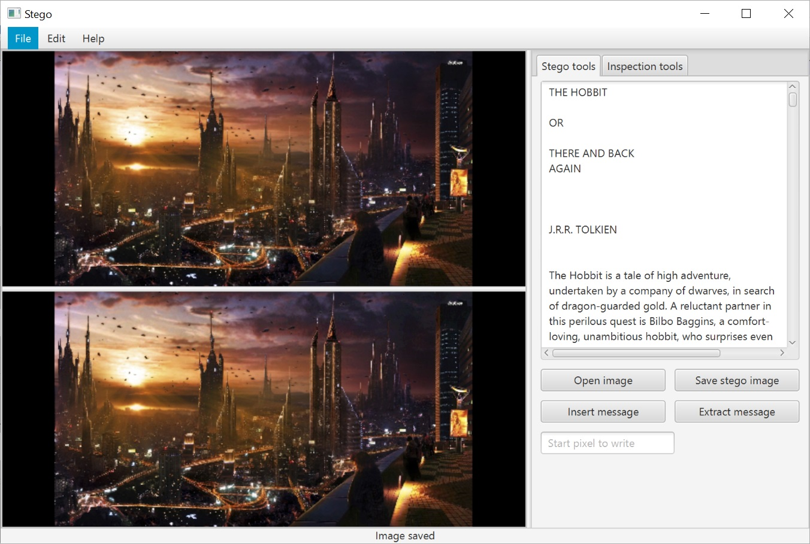

#### Steganography
Allows you to insert a message in a BMP image.  
You can insert an entire book into an image without losing  visual image quality.

Run
```shell
gradlew clean run
```

Create native image
```shell
gradlew clean jlink
```
Image location
```shell
./build/image/bin
```

---
Java 11 is required.


